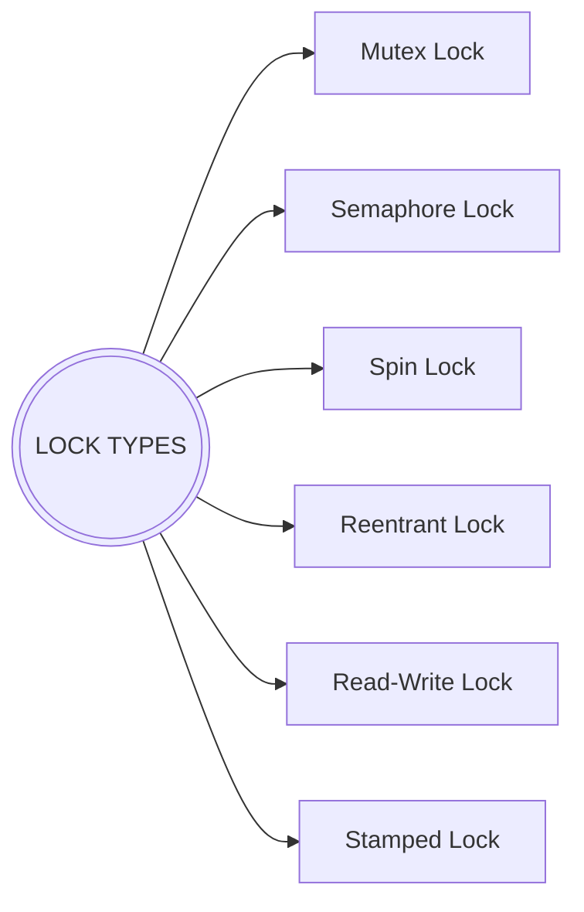

## Locks

https://stackoverflow.com/questions/2332765/what-is-the-difference-between-lock-mutex-and-semaphore
https://stackoverflow.com/questions/34519/what-is-a-semaphore/40238#40238

```mermaid
flowchart LR
    LT(((LOCK TYPES))) --> MUTEX[Mutex Lock]
    LT --> SEMAPHORE[Semaphore Lock]
    LT --> SPIN[Spin Lock]
    LT --> REENTRANT[Reentrant Lock]
    LT --> RW[Read-Write Lock]
    LT --> STAMPED[Stamped Lock]
```